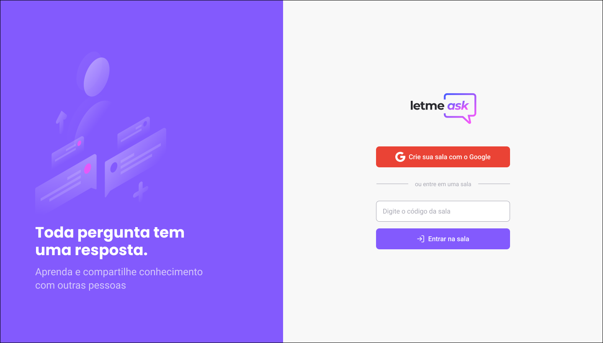

<h1 align="center">Letmeask</h1>

<h1 align="center">
    
</h1>

<h4 align="center"> 
	🚧  Situação: Concluído 🚀 🚧
</h4>

## 💻 Sobre o projeto

🚀 Letmeask é um projeto desenvolvido durante a Next Level Week Together. O objetivo da aplicação é proporcionar uma plataforma de perguntas e respostas que seja interativa e que atualize em tempo real!

---

## ⚙️ Funcionalidades

- [x] Qualquer um pode se cadastrar no site
- [x] Usuários cadastrados podem criar salas ou entrar em salas
- [x] Usuários que criaram as salas podem:
    - Deletar uma pergunta
    - Marcar uma pergunas como "respondida"
    - Marcar uma pergunta como "está sendo respondida"
    - Encerrar a sala
- [x] Usuários podem entrar nas salas e realizar perguntas

---

## 🛠 Tecnologias

Foram utilizados as seguintes ferramentas:

#### **Website**  ([React](https://reactjs.org/)  +  [TypeScript](https://www.typescriptlang.org/))

-   **[React Router Dom](https://github.com/ReactTraining/react-router/tree/master/packages/react-router-dom)**

#### **Server**  ([Firebase](https://firebase.google.com/?gclid=CjwKCAjwoNuGBhA8EiwAFxomA0M3hYSEDI4_8xAYxjs_OkG6pYabrbZWKVwJU5ONuRKmfHqnLN2z1BoCbHsQAvD_BwE&gclsrc=aw.ds))

---

## 📝 Licença

Este projeto esta sobe a licença [MIT](./LICENSE).

Feito por Gabriel Vieira 👋🏽.

---
